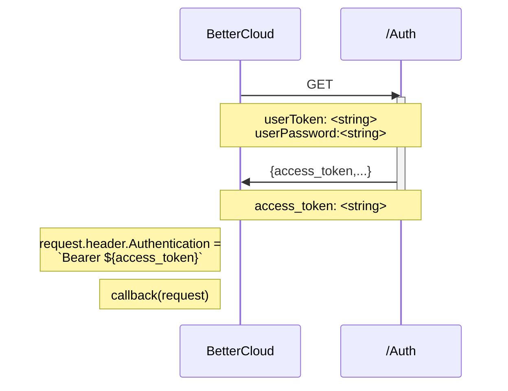
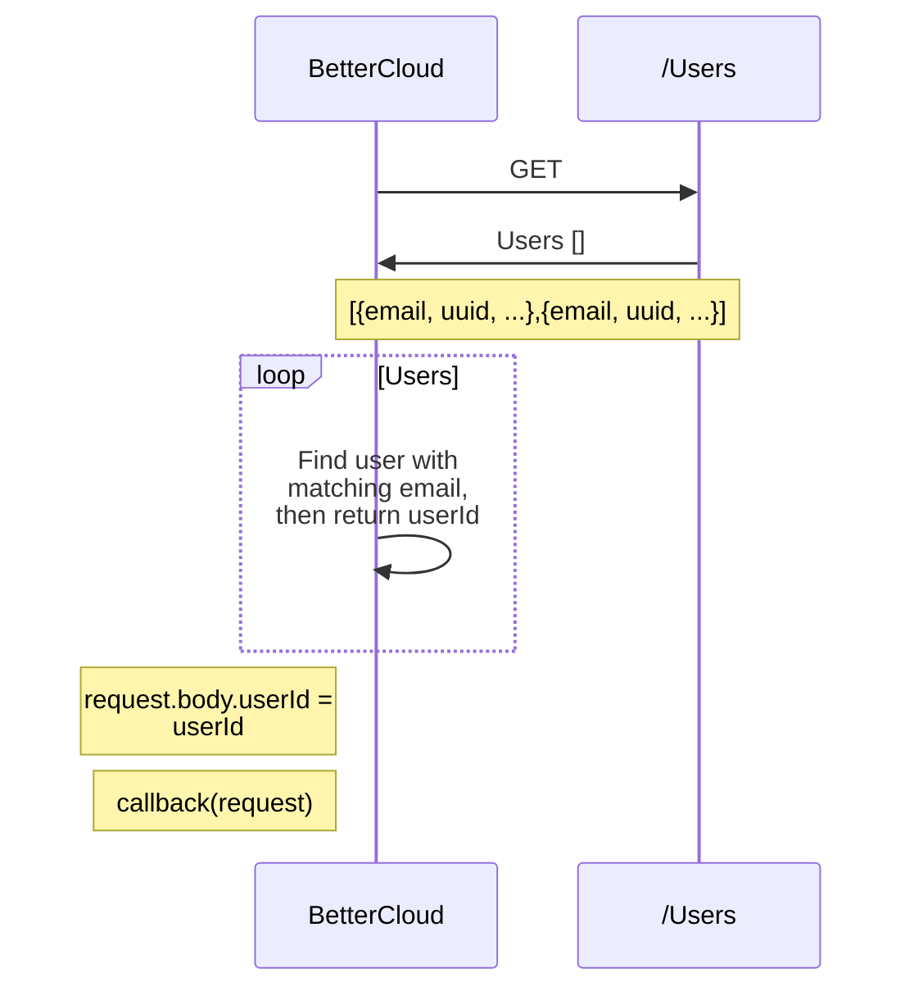

# Notes
* This integration uses access id and secret. Be ready with a password manager to store this information securely. Sharing of these details may result in bad actors having access to NICE inContact 
* If access id and access secret details are shared, you may delete them and generate a new set via the Admin console.
# Requirements
* BetterCloud Admin Account
* Nice inContact Admin Account
* Nice inContact Service Account with Admin role
* BetterCloud API SKU

# Configuration
## Authentication Setup
1) Go to [NICE inContact login page](https://login.incontact.com)
2) Login to Admin panel
   * Enter Admin credential email
   * Enter Admin password
   * Go to Admin settings
     * Click on the grid in the upper-left corner
     * Under General, select Admin
3) Service Account
    * If you haven't, create a service account for BetterCloud
      * Create an account with a descriptive email, e.g. bettercloud@yourcompany.com
    * This is important because credentials will be linked to the account that creates them. If you use a current administrators account, the credentials will be invalidated should that user leave and their account deactivated.
4) Permissions
    * The service account needs to have "Administrator" permissions.
5) Create credentials
    * Go to the [Admin Users module](https://na1.nice-incontact.com/admin/#/userManagement)
    * Find, then click on the BetterCloud service account you created
    * In the resulting window, select **ACCESS KEYS**
    * Click **Generate New Access Key**
    * Copy **Access Key Id**, store in a secure password manager
    * Copy **SECRET ACCESS KEY**, store it in a secure password manager
      * Click **(SHOW SECRET KEY)**
      * The pop-up will display the key
    * Leave **STATE** as **ON**
    * Click **SAVE**

## BetterCloud Setup
1) Login to BetterCloud
   1) Go to [BetterCloud App](https://app.bettercloud.com)
   2) Login using SSO using Admin account
2) Create Custom Integration
   1) Go to the [Integration Center](https://app.bettercloud.com/#/integration-center)
   2) Click **Create A Custom Integration**
      1) Name: NICE inContact
      2) Logo
         * Type "nice"
         * Select "NICE inContact"
      3) Authentication: None
      4) Leave box unchecked
      5) Click **Save**
3) Add Environment Variables
   1) Click **Environment Variables**
   2) Add "accessKeyId" secret
      1) Click **Add An Environment Variable**
      2) Key Name: **accessKeyId**
      3) Value: **< Access Key Id >**
   3) Add "accessKeySecret" secret
       1) Click **Add An Environment Variable**
       2) Key Name: **accessKeySecret**
       3) Value: **< SECRET ACCESS KEY >**
   4) Add "region" secret
       1) Click **Add An Environment Variable**
       2) Key Name: **region**
       3) Value: **< region >**, 
          1) options: na1, na2, na3, eu1, eu2, eu3, au1, au2, au3
4) Add Pre Request Script

# Operation
## Get Token | Pre Request

## Get User ID | Pre Request
